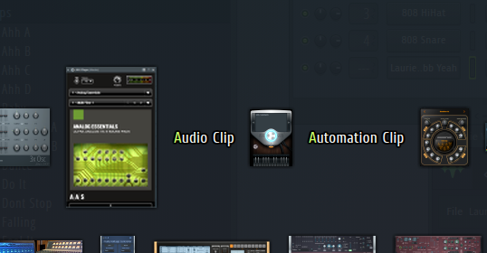
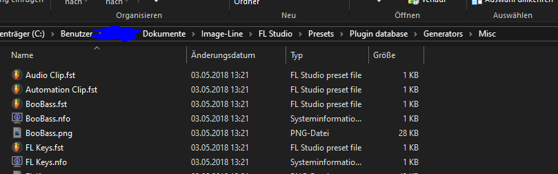
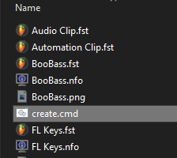
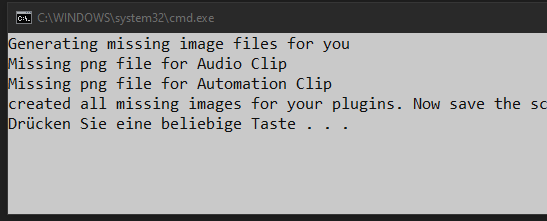
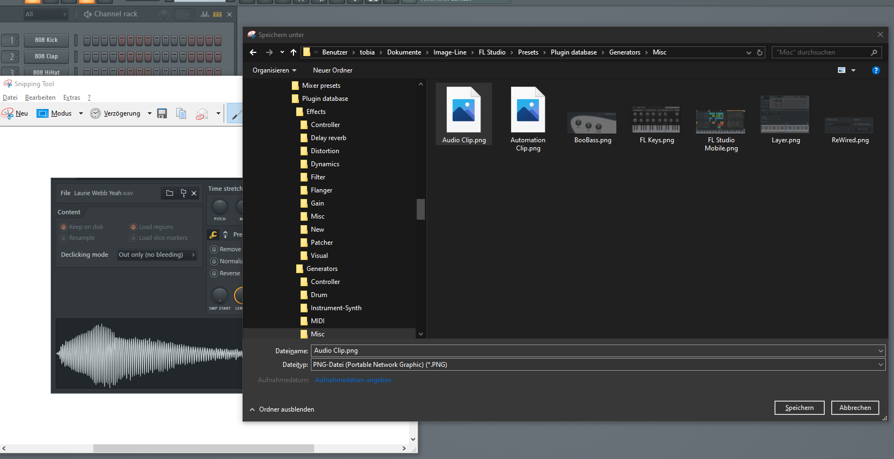
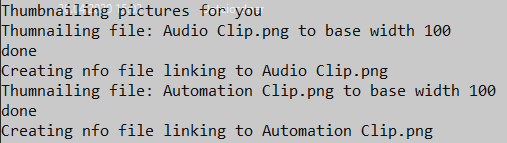
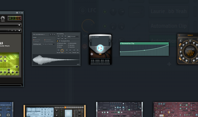

# FL Plugin Beautifier

### Requirements

* Python 2 or 3
* FL Studio

### How to use

This repo consists of 3 files

 * create.cmd
 * thumbnail.cmd
 * thumbnailer.py

1. Copy the 3 files listed above into the folder where your generators and effects are located
For example to: `C:\Users\....\Documents\Image-Line\FL Studio\Presets\Plugin database\Generators`
2. Run the ``create.cmd`` file. It will create .png files for every plugin where it does not exist. 
3. Create screenshots of your plugins and save them as the .png file created by `create.cmd`
4. After you have all your screenshots saved, run ``thumbnail.cmd`` to get all the screenshots into the right size as well as the nfo files linking to them. Both the png files and the nfos are hidden after thumbnailing.
5. Open FL Studio and enjoy!

### Tutorial

These are two missing thumbnails for 2 plugins / effects / actions

Find them in the explorer

Copy the create.cmd file and execute it

It will create the missing png files

Now make screenshots and save them in the created files. 

Copy the thumbnailer.py as well as the thumbnail.cmd into the same folder and run the thumbnail.cmd file. It will resize the pictures and create a nfo linking to the files so fl studio finds them. 

If you reopen FL Studio you now have nice thumbnails. 

